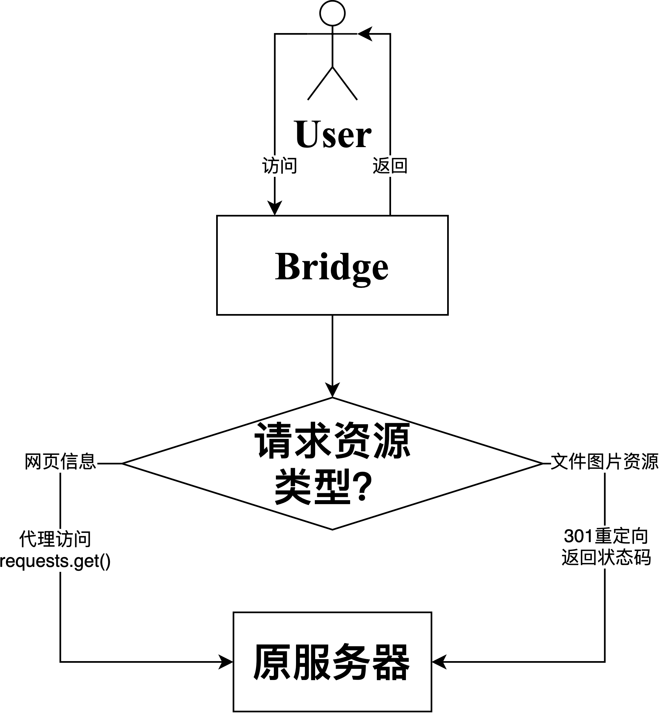

# 消防协会项目暂时解决方案

---

Date: 2020\-2\-17

---

## 导言

当下，消防协会网站中的：

- flash元素
- 部分信息

已经过时，无法正常显示或含有错误信息，需要进行部分修正，但原有项目使用的asp.net技术，在当下较难理解、部署、重新开发。

## 解决方案

设置一代理，用户不再直接访问原官网，而是访问代理服务器；代理服务器代替用户进行访问。

### 网页信息

对于网页信息而言，Bridge会将用户请求的url中的域名进行替换，替换后向原服务器发送一个相同的请求，获取响应后，将原本错误的网页信息进行替换后，将替换后的信息作为响应体进行响应。

### 图片、文件资源

处理图片文件是一件繁琐的事情，Bridge会对url进行解析，**如果`FILE_TYPE`列表中的字符串出现在url中，就认为用户在请求图片、文件资源**，此时Bridge会将用户的url中的域名部分进行替换，并且将替换后的域名（原服务器中的资源地址）当作301重定向中的`location`关键词进行响应。

## app.py流程大体分析

开发环境：`python3`使用`flask`框架进行开发。flask中，将某函数使用注解`@app.errorhandler(404)`，表示无匹配路由时使用该函数进行处理。本项目没有设置其他路由，通过上方的注解，将所有请求都分配给函数`err_handler_404`进行处理。

该函数会对使用`check_file`函数区别请求资源的类型：

- 返回`True`：在请求文件资源，进行301重定向
- 返回`False`：在请求其他资源，进行代理访问

代理访问时，会使用`requests`包向原服务器发送请求，获取请求后，**使用`GBK`进行编码，并且使用`replace_str`函数对关键信息进行替换。**

**需要特别注意的是：当前所有代理请求都默认为`http GET`请求，如果站点内存在其他请求类型，那么一定会发生错误！！！**

**需要特别注意的是：当前所有代理请求都默认为`http GET`请求，如果站点内存在其他请求类型，那么一定会发生错误！！！**

**需要特别注意的是：当前所有代理请求都默认为`http GET`请求，如果站点内存在其他请求类型，那么一定会发生错误！！！**

**需要特别注意的是：当前所有代理请求都默认为`http GET`请求，如果站点内存在其他请求类型，那么一定会发生错误！！！**

**需要特别注意的是：当前所有代理请求都默认为`http GET`请求，如果站点内存在其他请求类型，那么一定会发生错误！！！**

